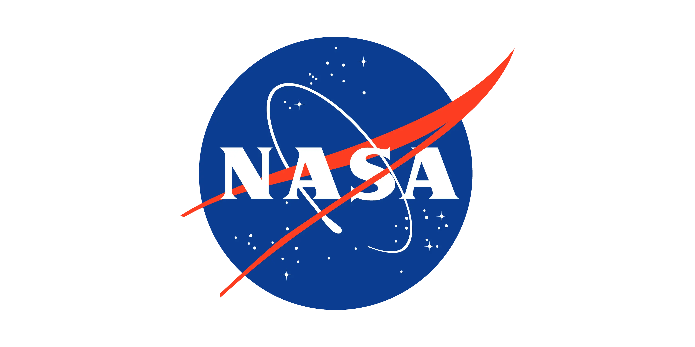

💡 If you're using Zarr in any way and would like to be added on this page, please drop your logo and blurb <a href="https://github.com/zarr-developers/community/issues/60">here</a>.

 Thanks to the amazing community, Zarr is widely adopted and used by:

→ The <a href="https://www.openmicroscopy.org/">Open Microscopy Environment (OME)</a> community is developing a format, OME-Zarr, using Zarr to store large, n-dimensional biological images as part of the <a href="https://ngff.openmicroscopy.org/">Next-generation file format (NGFF)</a> effort."

OME logo used by <a href="https://www.openmicroscopy.org/artwork/">permission</a>, trademarked <a href="https://www.glencoesoftware.com/">Glencoe Software, Inc.</a>

---

→ <a href="https://www.unidata.ucar.edu/">Unidata</a> is developing its netCDF libaries to support Zarr datasets amongst the atmospheric and geoscientific community.

---

→ Zarr is used by NASA as an analysis-ready data store for chunked, N-dimensional arrays of geospatial data.

---

→ scalable minds uses Zarr to store and process peta-scale 3D images of brain tissue for Connectomics analyses.

---

→ WEBKNOSSOS is a web-based platform for visualizing, collaboratively annotating and sharing large 3D images. Zarr is used for accessing remotely stored images as well as securely streaming annotation data to client applications.

---

→ Zarr is used extensively within the <a href="https://pangeo.io/">Pangeo Project</a> as a cloud native storage format for ocean, weather, climate, and geospatial data.

---

→ Zarr is used by the <a href="https://leap.columbia.edu/">LEAP Project</a> (Learning the Earth with Artificial Intelligence and Physics) at Columbia University as the data format for the LEAP-Pangeo data library. LEAP researchers use Zarr to perform data analytics and machine learning for climate modeling.

---

---

---

→ Zarr is used by the <a href="https://planetarycomputer.microsoft.com/">Microsoft Planetary Computer</a> as a cloud-native storage format for chunked, N-dimensional arrays of geospatial data.

---

→ Zarr is currently used by DANDI for lightsheet microscopy and some ex vivo MRI datasets, and is being considered as a backend for Neurodata Without Borders (NWB) neurophysiology datasets.

---

---

→ Zarr is used by <a href="https://carbonplan.org/">CarbonPlan</a> as a storage format for analysis and visualization of climate data.

---

→ Zarr is used extensively within Janelia Research Campus for efficiently storing and accessing large imaging datasets

---